# 🌟 **Introduction to Generative AI with Vertex AI: Prompt Design**

## 📖 **Module Overview**
This module focuses on **prompt engineering** and **best practices** for designing effective prompts to enhance the quality of responses generated by large language models (LLMs). You will gain practical experience in crafting prompts that are:
- **Concise**  
- **Specific**  
- **Well-defined** (focusing on one task at a time)  

Additionally, the module introduces advanced techniques, such as:
- Transforming generative tasks into classification tasks.  
- Utilizing examples to improve response accuracy.  

For further exploration, consult the official documentation on prompt design.

---

## 🌐 **About Gemini and Vertex AI Integration**

### 🔍 **Gemini**  
**Gemini** is a powerful family of generative AI models developed by **Google DeepMind**, capable of processing and generating various forms of content, including:
- Text  
- Code  
- Images  
- Audio  
- Video  

### 🧩 **Gemini API in Vertex AI**  
The **Gemini API** within **Vertex AI** offers a unified interface for seamless integration of Gemini models into applications. This API enables developers to leverage advanced AI capabilities with ease.  
For the latest updates and features, refer to the [official Gemini documentation](https://cloud.google.com/vertex-ai/docs/generative-ai).

---

## 💡 **Gemini Model Variants**

1. **Gemini Pro**:  
   Designed for tasks requiring complex reasoning, such as:  
   - Analyzing and summarizing large datasets.  
   - Sophisticated cross-modal reasoning (text, code, images, etc.).  
   - Effective problem-solving in complex codebases.

2. **Gemini Flash**:  
   Optimized for **speed** and **efficiency**, providing:  
   - Sub-second response times with high throughput.  
   - High-quality outputs at reduced costs.  
   - Enhanced multimodal capabilities, including:  
     - Improved spatial understanding.  
     - New output modalities (text, audio, images).  
     - Native tool usage (Google Search, code execution, third-party functions).

---

## ⚙️ **Prerequisites**  
Before beginning this lab, ensure you are familiar with:  
- **Basic Python programming**.  
- **General API concepts**.  
- **Running Python code** in a Jupyter notebook on **Vertex AI Workbench**.

---

## 🎯 **Learning Objectives**  
Upon completing this lab, you will be able to:  
- Utilize the **Google Gen AI SDK** for prompt engineering.  
- Apply **best practices** for prompt design, focusing on conciseness, specificity, and clear task definition.  
- Explore diverse **text generation use cases**, including:  
  - Ideation  
  - Question answering  
  - Text classification  
  - Text extraction  
  - Text summarization  

---

## 🖥️ **Lab Setup and Requirements**

### ✅ **Before You Start**  
- **Labs are timed**: Once started, you cannot pause the lab.  
- **Real Cloud Environment**: You will work in a real cloud environment using temporary credentials provided during the lab.  

### 🌐 **System Requirements**  
- Access to a **standard internet browser** (**Chrome** recommended).  
- **Incognito/Private window** usage is recommended to avoid conflicts with personal Google Cloud accounts.  

### ⏳ **Time Management**  
- The lab is designed to be completed in **45 minutes**.  
- Ensure uninterrupted access to your system for the entire lab duration.

---
---
---

# 📘 **Prompt Design in Vertex AI - A Step-by-Step Guide**

This guide provides detailed instructions on how to complete the *Prompt Design* lab in **Vertex AI Workbench** using **Google Cloud's Generative AI tools**. By following these steps, you will gain hands-on experience in **prompt engineering best practices** to optimize AI-generated responses.

---

## 🚀 **Task 1: Open the Notebook in Vertex AI Workbench**
### **1️⃣ Access Vertex AI Workbench**
1. **Navigate to Vertex AI**  
   - In the **Google Cloud Console**, open the **Navigation menu**.
   - Click **Vertex AI > Workbench**.  
   - 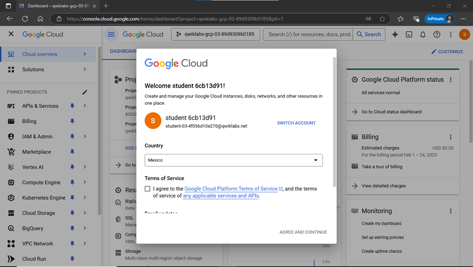

2. **Launch JupyterLab**  
   - Locate the **vertex-ai-jupyterlab instance** and click **Open JupyterLab**.  
   - This opens **JupyterLab** in a new browser tab.  
   - 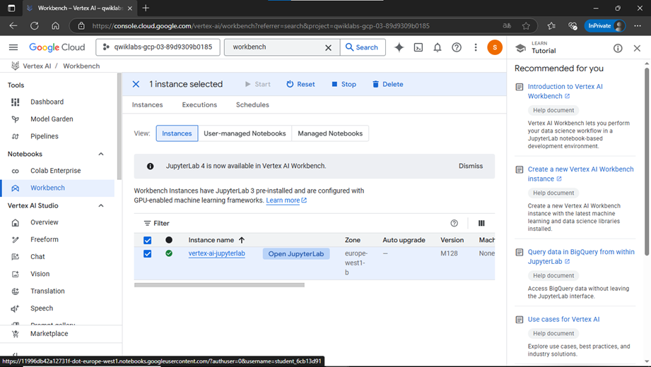  
   - 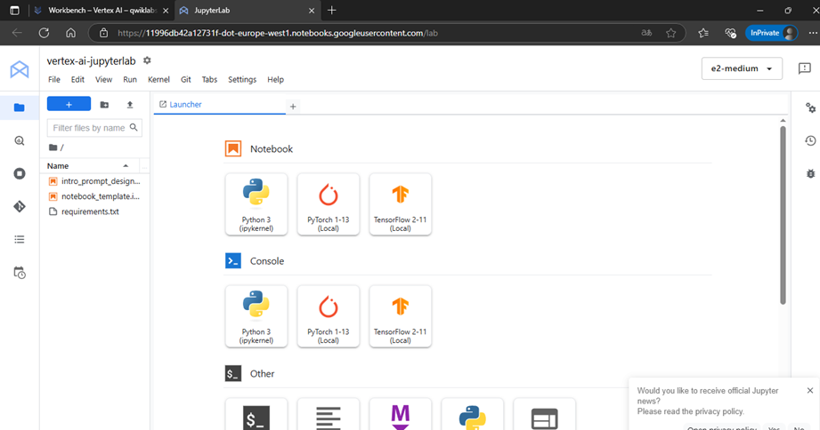  

---

## ⚙️ **Task 2: Set Up the Notebook**
### **1️⃣ Open the Notebook & Select Kernel**
1. **Open the `intro_prompt_design.ipynb` notebook** from the JupyterLab file explorer.
2. **Select the Python 3 Kernel**  
   - When prompted, choose **Python 3** as the kernel.  
   - 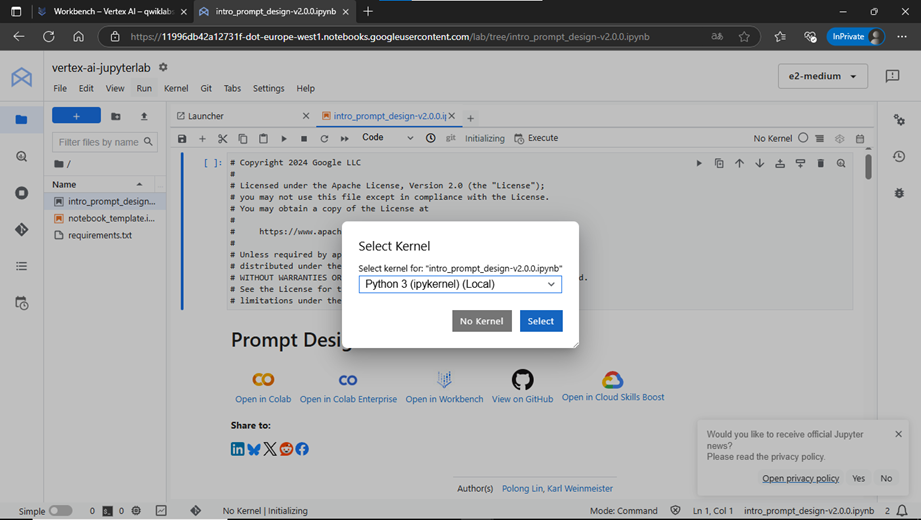

### **2️⃣ Run Initial Notebook Cells**
1. **Execute the "Getting Started" and "Import Libraries" sections**.
   - Use **Project ID:** `qwiklabs-gcp-03-89d9309b0185`  
   - Use **Location:** `europe-west1`
2. **Skip Colab-specific cells**.
3. **If you encounter a 429 response error, wait 1 minute and retry.**  

📌 *Click "Check My Progress" to validate your setup.*  

   - 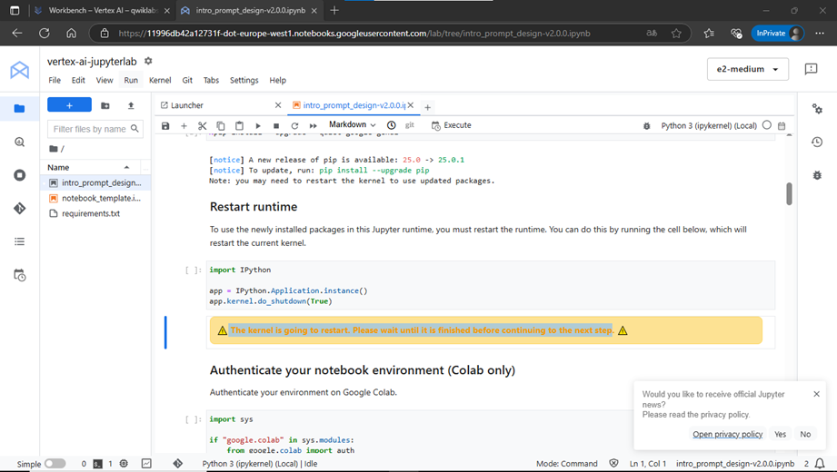  
   - 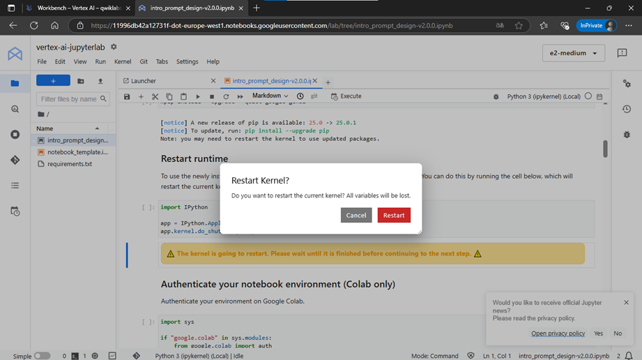  
   - 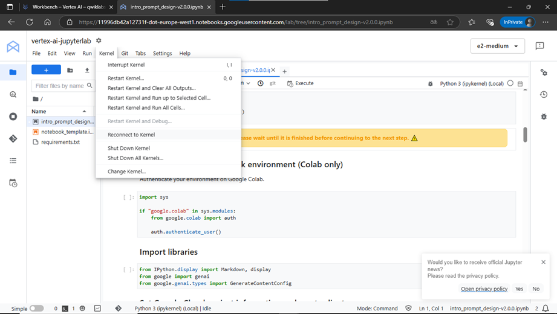  

---

## 🎯 **Task 3: Prompt Engineering Best Practices**
### **Optimizing Prompts for Effective AI Responses**
Prompt engineering focuses on **designing prompts** that yield the most relevant and accurate responses from an **LLM (Large Language Model)**.  

📌 Follow these **best practices** when designing prompts:  
- ✅ **Be concise** - Avoid unnecessary words.  
- ✅ **Be specific and well-defined** - Provide clear instructions.  
- ✅ **Ask one task at a time** - Keep prompts focused.  
- ✅ **Include examples** - Guide the LLM with structured examples.  
- ✅ **Convert generative tasks into classification tasks** - Enhances safety and accuracy.  

   - 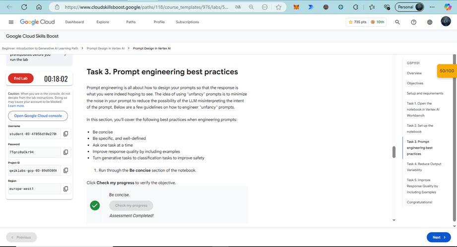  
   - 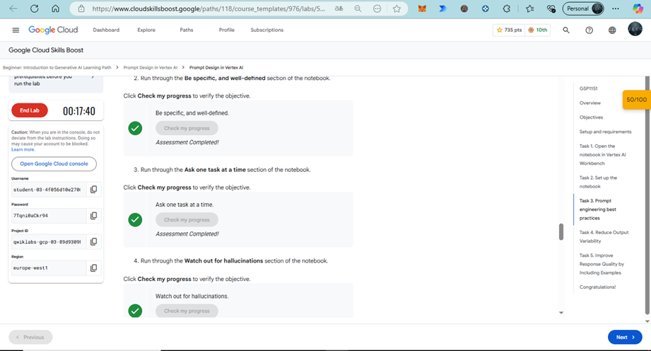  

---

## 🔄 **Task 4: Reduce Output Variability**
### **Minimizing Hallucinations and Irrelevant Responses**
To **reduce inconsistencies** in LLM-generated responses:  
1. **Use system instructions** to define response behavior.  
2. **Apply constraints** to prevent model hallucinations.  
3. **Limit the randomness in output** by adjusting temperature and top-k sampling.  

📌 *In this section, you will apply these techniques to improve a travel chatbot's responses.*  

   - 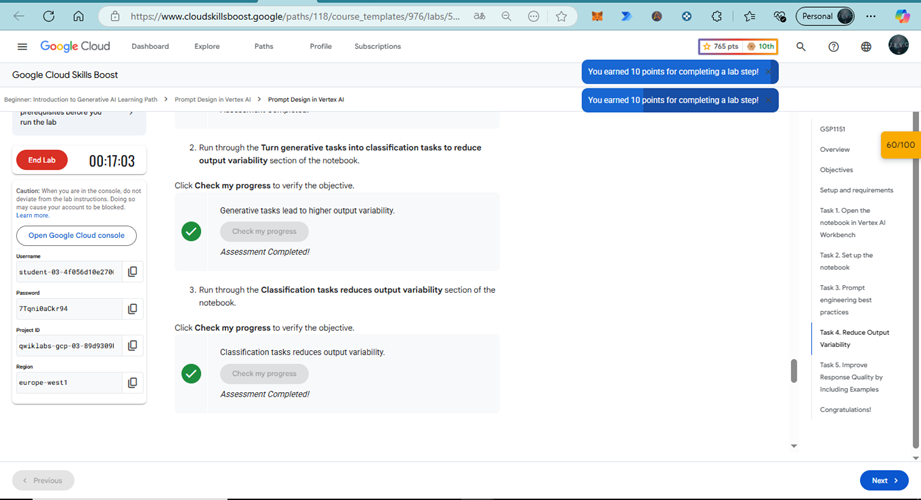  

---

## 🏗️ **Task 5: Improve Response Quality by Including Examples**
### **Enhancing Model Understanding with Contextual Examples**
1. **Incorporate examples in your prompts** to guide the LLM’s behavior.  
2. **Use 1-5 representative examples** to maintain diversity without overfitting.  
3. **Ensure balanced example distribution** to align with real-world scenarios.  

📌 *Applying few-shot learning improves AI response accuracy and reliability.*  

   - 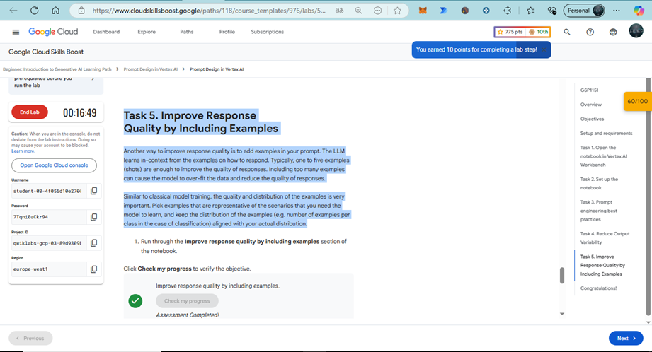  

---

## 🎉 **Congratulations!**
You have successfully completed the **Prompt Design Lab** using **Google's Generative AI tools**.  
In this lab, you explored:  
✅ **Best practices for prompt engineering**  
✅ **Techniques to reduce variability in responses**  
✅ **How to improve AI-generated outputs using structured examples**  

Your acquired knowledge will help **optimize LLM performance** and **enhance AI-generated outputs** in real-world applications.

   - 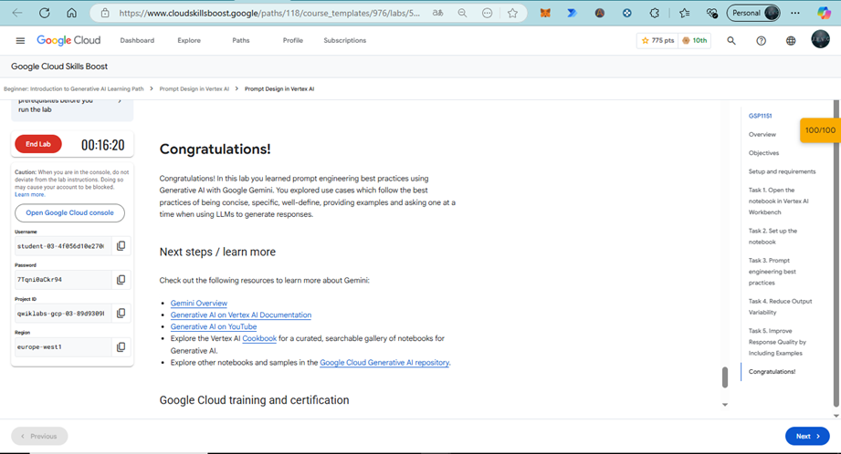  

---
📌 **Next Steps:**  
- Continue practicing with **more prompt variations**.  
- Experiment with **different model parameters** to fine-tune responses.  
- Apply these principles to **custom AI applications** in **Vertex AI**.  

  
🌟 Did you find any repository useful?

  If any project has been helpful to you, consider giving it a ⭐ star in the repository and follow my GitHub account to stay tuned for future updates! 🚀

  In addition, I am always open to suggestions, recommendations or collaborations. Feel free to [get in touch](https://www.linkedin.com/in/vazquez-galan-jose-emmanuel-664968221) if you have any questions or ideas for improving this project. I'm excited for your feedback and contributions.

  Thank you for your interest and support! 😊

 This work is licensed under a <a rel="license" href="http://creativecommons.org/licenses/by-nc-sa/4.0/">Creative Commons Attribution-NonCommercial-ShareAlike 4.0 International License</a>.

