# 🧭 **Getting Started with Vertex AI Studio — Image Analysis with Gemini**

This section outlines the initial hands-on experience with **Vertex AI Studio**, focusing on using **Gemini** in **Freeform mode** to analyze images, extract textual content, and experiment with prompt design. This walkthrough helps learners understand how to interact with Gemini’s multimodal capabilities using different prompt structures and configurations.

📂 **Image used in this lab is located at:**  
`Prompt_Design_in_Vertex_AI-JEVG/Get_Started_with_ Vertex_AI_Studio/zjN7W3mhXjZNtCFZb4Y1PAfOK_adVx5lXhKNC7vLYcg=.png`

---

## üîß **Task 1: Analyze Images with Gemini in Freeform Mode**

### ‚úÖ Enable the Vertex AI API

1. In the **Google Cloud Console**, use the top search bar to search for **Vertex AI API**  
   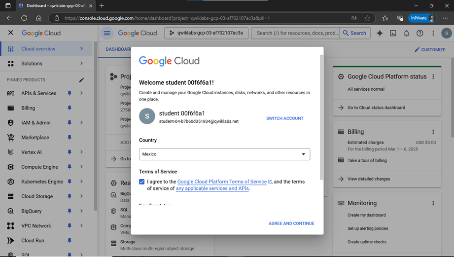

2. Click the **Vertex AI API** result under **Marketplace & APIs**  
   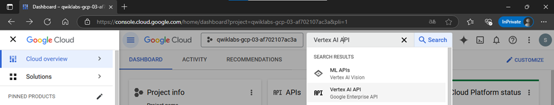

3. Click **Enable**  
   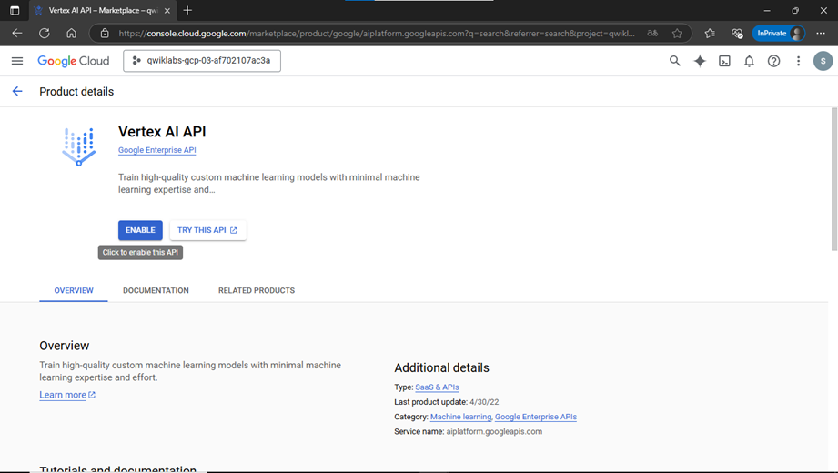  
   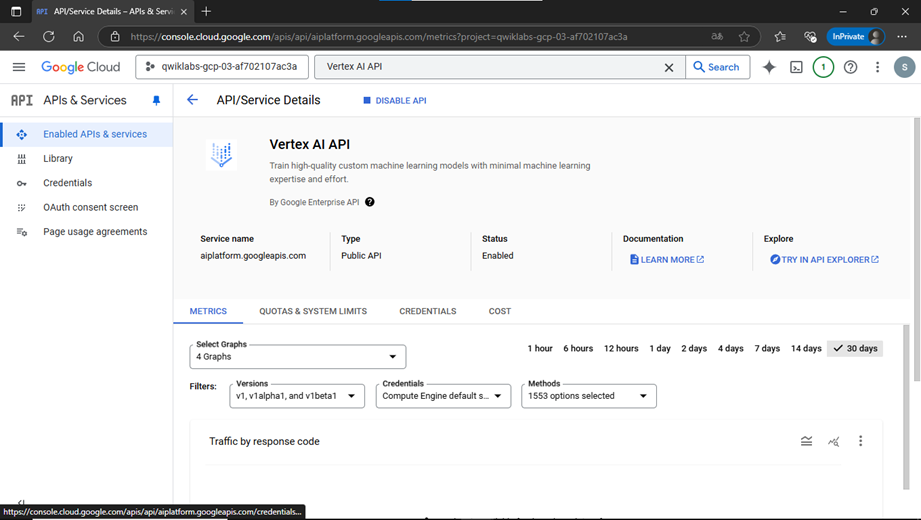

‚úÖ _Check your progress after enabling the API._

---

### üß™ Analyze Images with Gemini

1. In the **Google Cloud Console**, go to:  
   `Vertex AI > Vertex AI Studio > Overview`  
   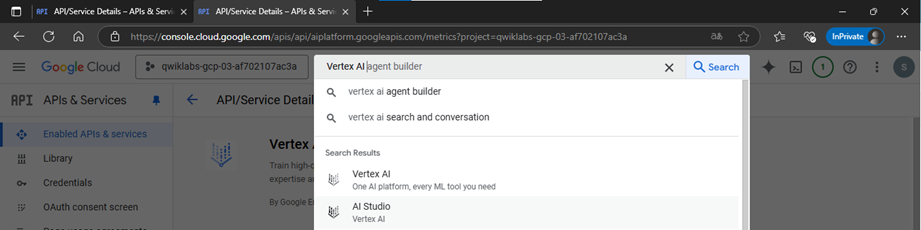  
   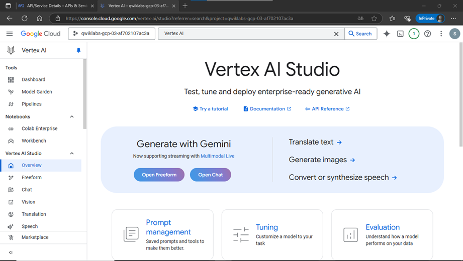

2. Under **Generate with Gemini**, click **Open Freeform**  
   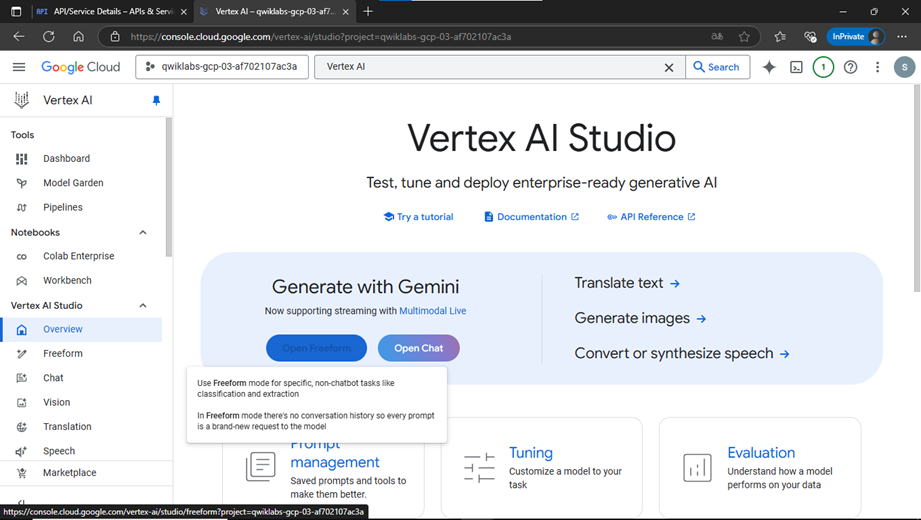

#### 🖥️ Interface Breakdown:
- **Prompt** (center): Area to insert your prompt and any media (image/video/audio/text).
- **Configuration** (right): Choose model, set parameters, and generate code.
- **Response** (bottom): Displays output.

   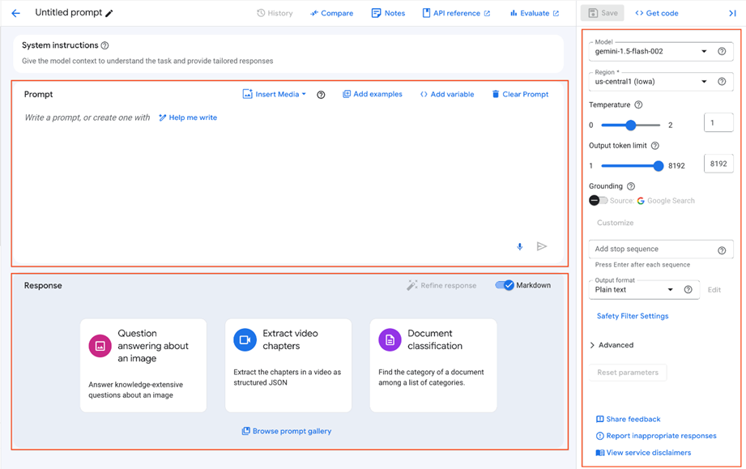

3. Click **Untitled Prompt** (top left) and rename it to `Image Analysis`.

4. In **Configuration**, select:
   - **Model**: `gemini-2.0-flash-001`  
   - **Region**: `us-west1`

5. **Download the image** used in the lab, and then:
   - Click **Insert media > Upload** (top right of Prompt box)
   - Upload the timetable image  
     
   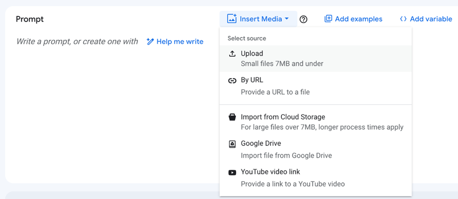  
   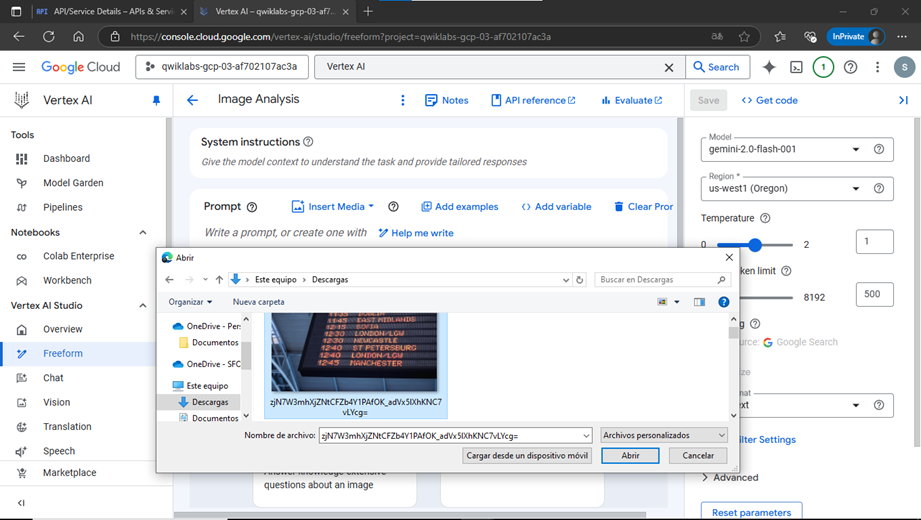

6. Once the image is uploaded, paste the following prompt and click **Submit**:

```text
Title the image.
```
9. Try making the prompt more specific:
> **Prompt:**  
> `Title the image in 3 words.`

   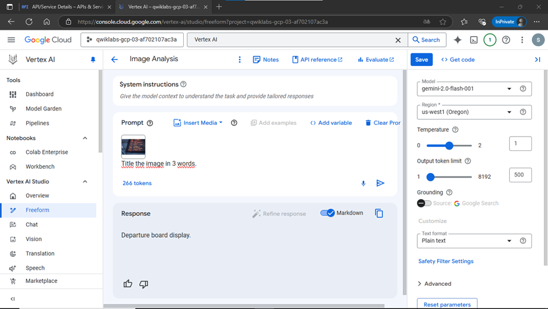

Evaluate if the output meets your expectations. If not, adjust the prompt wording and try again to observe different behaviors.

---

#### üîç Provide a More Detailed Instruction

10. Replace your previous prompt with:
> **Prompt:**  
> `Describe the image in detail.`

   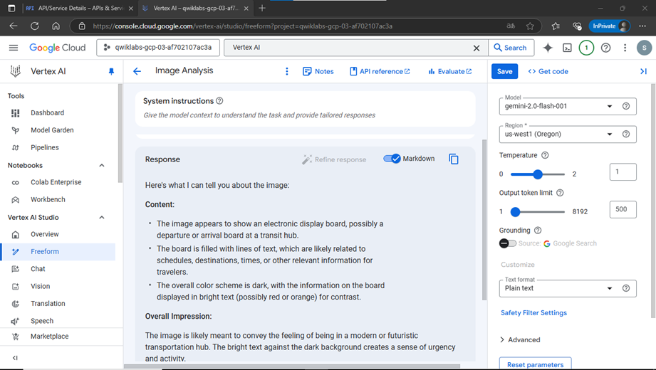

Then, **Submit** the prompt and observe the output quality and richness of detail.

---

### 🎛️ **Tune Model Parameters (Temperature)**

11. In the **Configuration** panel, adjust the **Temperature** parameter.

- Scroll the **Temperature** slider from `0` to `2`.  
- Resubmit the same prompt after changing the temperature.

> üîß **Temperature Explained:**
> - **0.0** – More deterministic and focused responses.  
> - **1.0+** – More diverse, creative, or unpredictable outputs.

---

### üî° **Text Extraction from Image**

12. Try extracting content from the image:
> **Prompt:**  
> `Read the text in the image.`

   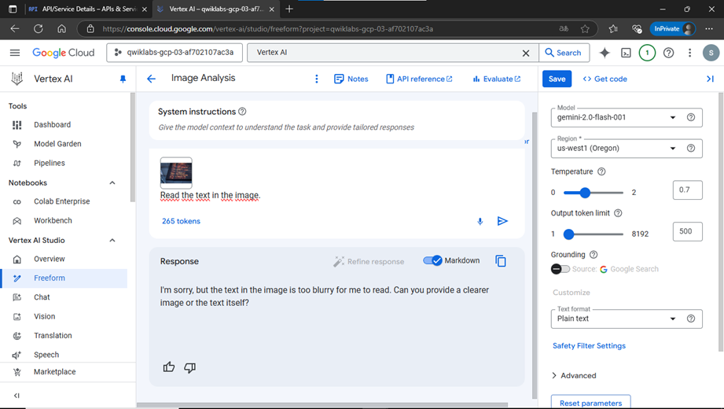

---

#### üìã Format as Structured Output

If you prefer the extracted text in a structured format, try this:
> **Prompt:**  
> `Parse the time and city in this image into a list with two columns: time and city.`

   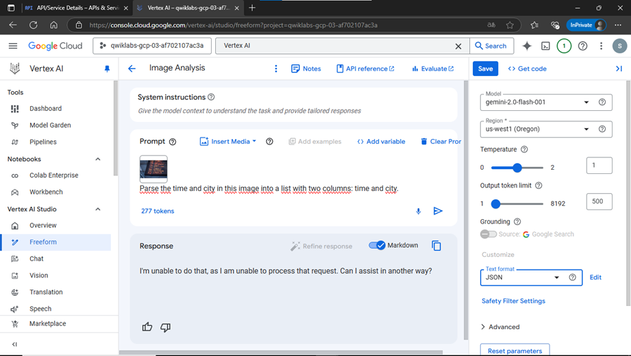

Observe how Gemini restructures the response based on the instruction. Experiment by rephrasing to improve the clarity or format.

---

### üåç **Advanced Prompt: Analyze Data**

13. Try analyzing patterns or statistics based on the image:
> **Prompt:**  
> `Calculate the percentage of the flights to different continents.`

   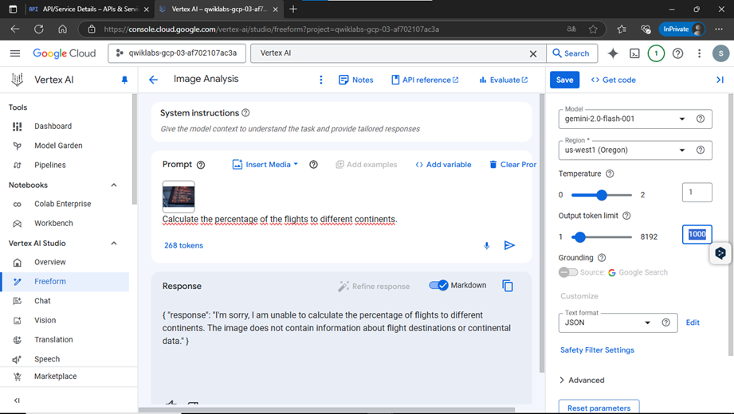

If the result isn't as expected, feel free to reword the prompt or simplify the task for better interpretation by the model.

---

## üíæ **Save Your Prompt Design**

14. Once satisfied with your prompt, click **Save** in the top-right of the **Configuration** section.

- Select `us-west1` as the region.
- Confirm by clicking **Save**.

> 🗂️ You can access saved prompts under **Prompt Management** from the left-hand menu.

> ‚è≥ Give it a few seconds after saving. If you see a "failed to update history" message, click **"Try again"**.

   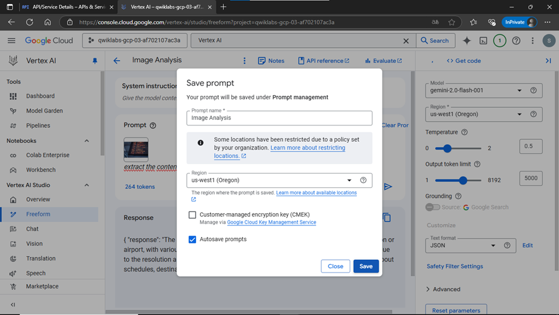

---

### ‚úÖ **Check Your Progress**

Click **Check my progress** to validate the task.

   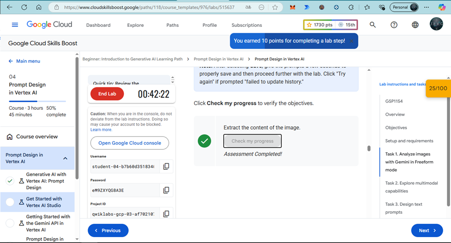

---

Feel free to test your creativity with new prompts and adjust temperature settings to explore Gemini's full potential in image interpretation and generation.


---

## üé• **Task 2: Explore Multimodal Capabilities with Gemini**

In this task, you'll explore how to use **videos** as input to Gemini within **Vertex AI Studio** and generate text outputs such as titles or descriptions.

---

### üîß Enable Video Analysis with Cloud Storage

1. Navigate to **Cloud Storage > Buckets** and **copy the name** of your storage bucket.
   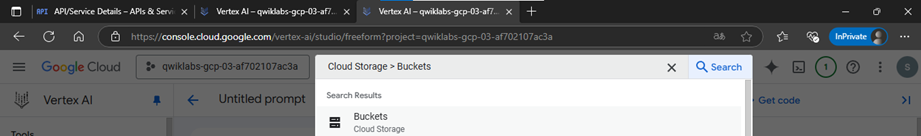

2. Click the **Activate Cloud Shell** icon at the top of the console.
   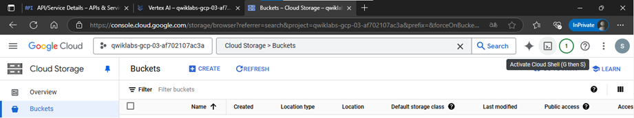  
   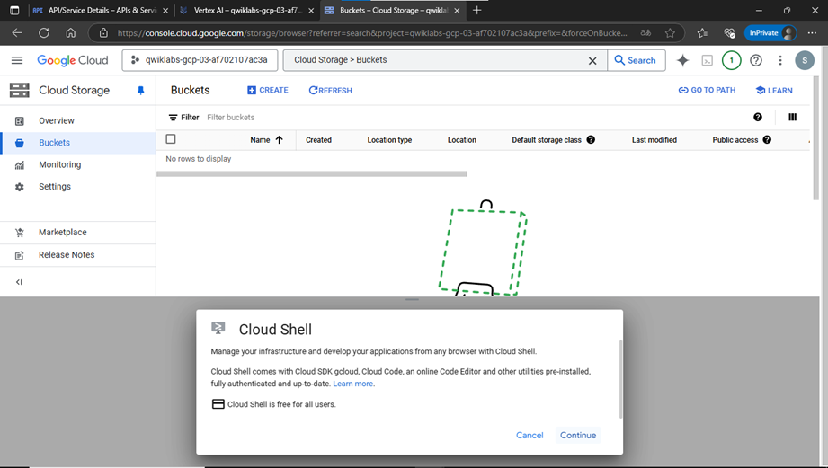

3. In your Cloud Shell terminal, copy the sample video to your bucket by executing the command below (replace with your bucket name):

```bash
gcloud storage cp gs://spls/gsp154/video/train.mp4 gs://<Your-Cloud-Storage-Bucket>
```
- Example, my URL looks like: 
gcloud storage cp gs://spls/gsp154/video/train.mp4 gs://vertexai_jevg
 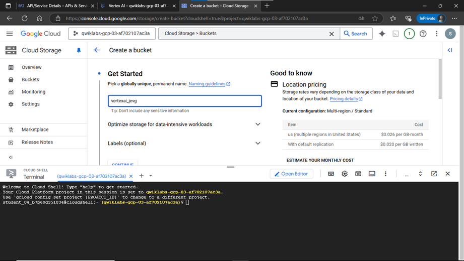

Note: Make sure to replace the <Your-Cloud-Storage-Bucket> with your bucket name.
 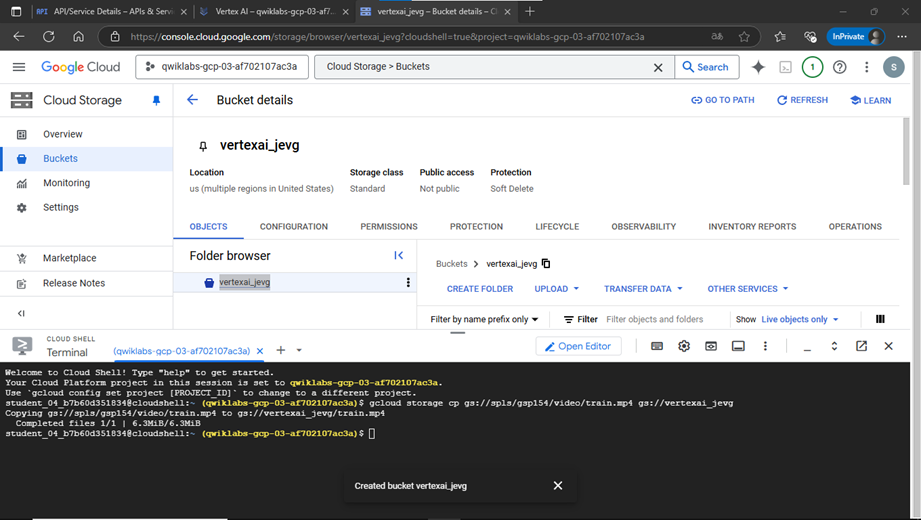


4. From the **Navigation menu**, select **Vertex AI > Vertex AI Studio > Overview**.  
   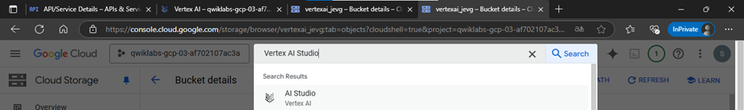

5. Under **Generate with Gemini**, click **Open Freeform**.  
   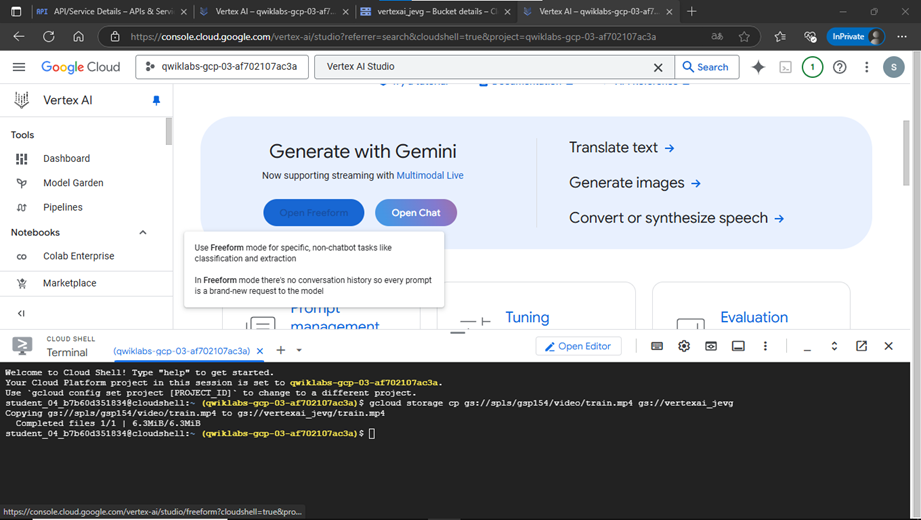

6. In the **Configuration** section on the top right, click on the **Model** dropdown and select `gemini-2.0-flash-001`.  
   _Note: The model name and version may change with new releases._

7. For **Region**, select `us-west1`.

8. Click **Insert Media > Import from Cloud Storage**.  
   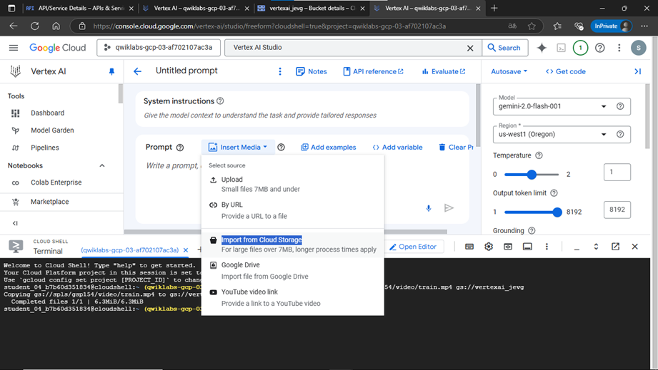

9. Locate and select your Cloud Storage **bucket**, click the sample video (`train.mp4`), then click **Select**.  
   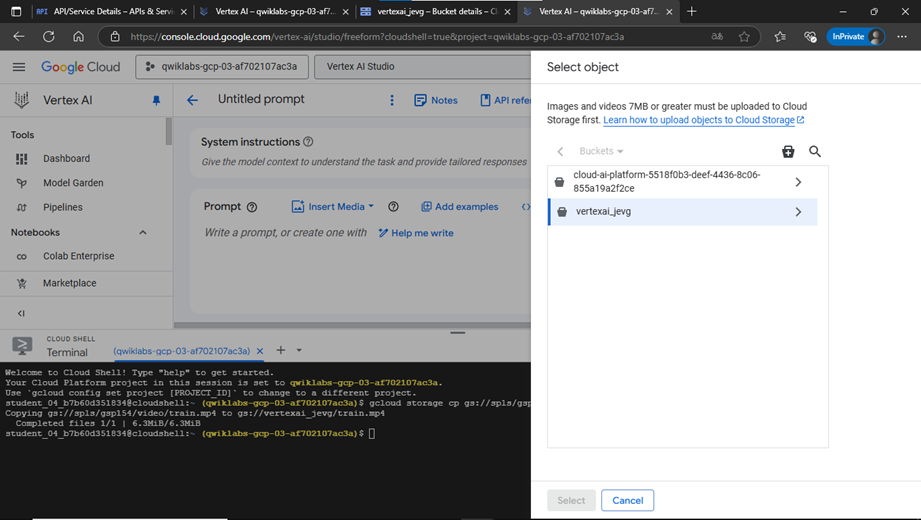  
   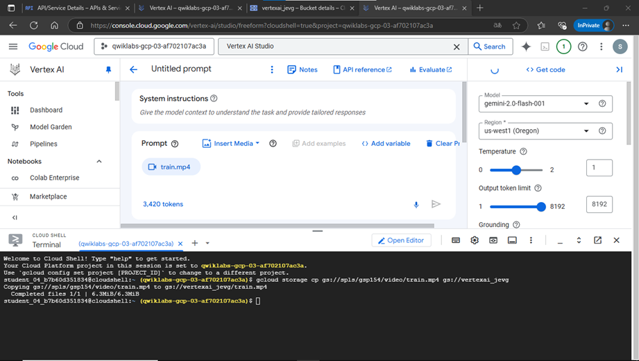

10. To generate information about the video, insert the following prompt:

```text
Title the video.
```

 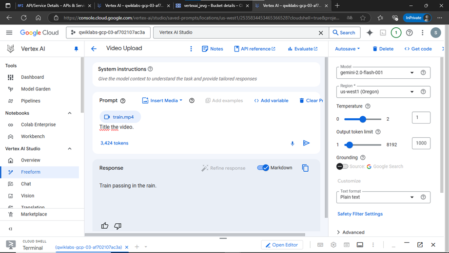

***Freeform mode offers many capabilities such as writing stories from images, analyzing videos, and generating multimedia ads. Explore more freeform use cases by clicking Prompt gallery. Check out more information about design multimodal prompts.***


---

## 🧠 Task 3: Design Text Prompts in Vertex AI Studio

This section guides you through the process of creating **text prompts** using **zero-shot**, **one-shot**, and **few-shot** methods in **Vertex AI Studio**. You will learn how prompt structure, examples, and configuration parameters can influence the quality and relevance of the model's responses.

---

### üßæ What is Prompt Design?

**Prompt Design** is the practice of crafting inputs to large language models (LLMs) in a way that leads to the desired response. This process is key to maximizing the effectiveness of generative AI in various tasks.

---

### 🎯 Prompt Design Methods

There are three primary techniques for designing prompts:

- **Zero-shot prompting**  
  Provide only the task without any examples.  
  _Example_:  
  `"What is prompt design?"`

- **One-shot prompting**  
  One-shot prompting - This is a method where the LLM is given a single example of the task that it is being asked to perform. Include a single example to guide the model.  
  _Example_:  
    `"if you want the LLM to write a poem, you might give it a single example poem."`

- **Few-shot prompting**  
Include several examples to help the model generalize.  
_Example_:  
Provide 2–5 news articles before asking the model to write a new one.

- **Temperature** (range: 0 - 2)  
Controls randomness of output.
- `0`: Most deterministic
- `>1`: More creative/unpredictable

- **Token Limit**  
Sets the max response length.  
(Roughly 1 token = 4 characters)

---

### üöÄ Try Zero-Shot Prompting

1. Navigate to **Vertex AI Studio > Overview** and click **Open Freeform**.  
   
 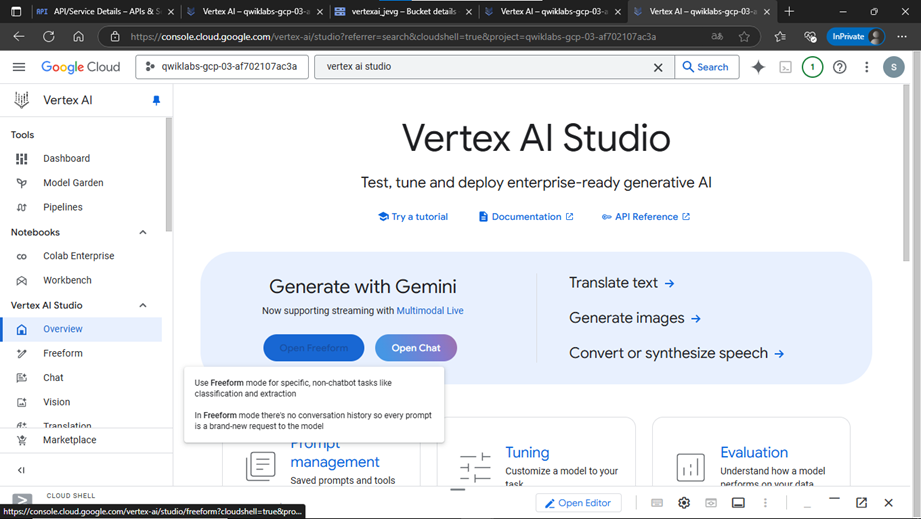

2. In the top-right **Configuration** section, under **Model**, select `gemini-2.0-flash-001`.  
 _Note: Model name and version may vary with updates._

3. For **Region**, select `us-west1`.  
 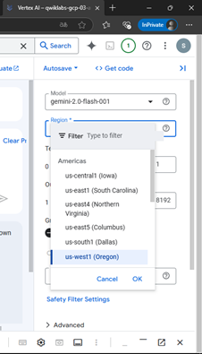

4. In the **Prompt** area, enter the following text:

```text
What is the difference between machine learning and deep learning?
```

5.	Click on the Submit arrow button.
 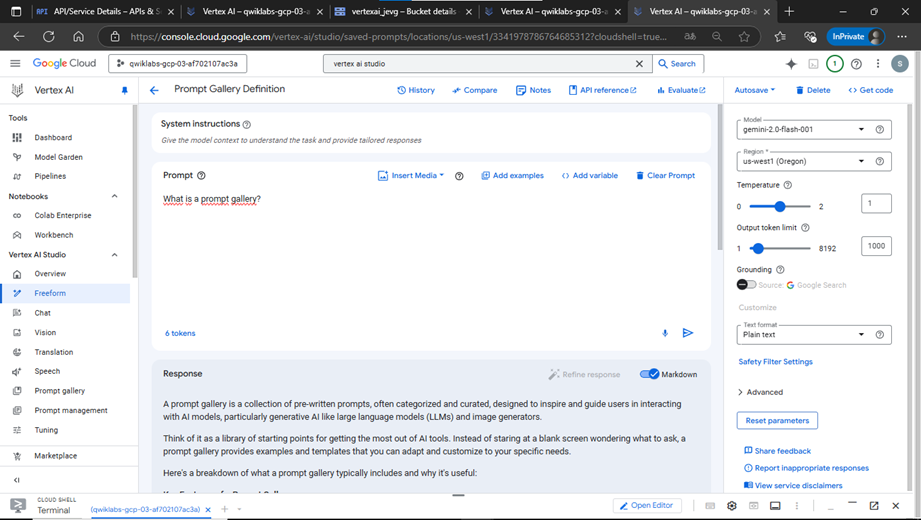

***The model will respond to a comprehensive definition of the term prompt gallery.***
Here are some exploratory exercises to explore.
•	Adjust the Output Token limit parameter to 1024 and click the SUBMIT arrow button.
•	Adjust the Temperature parameter to 0.5 and click the SUBMIT arrow button.
 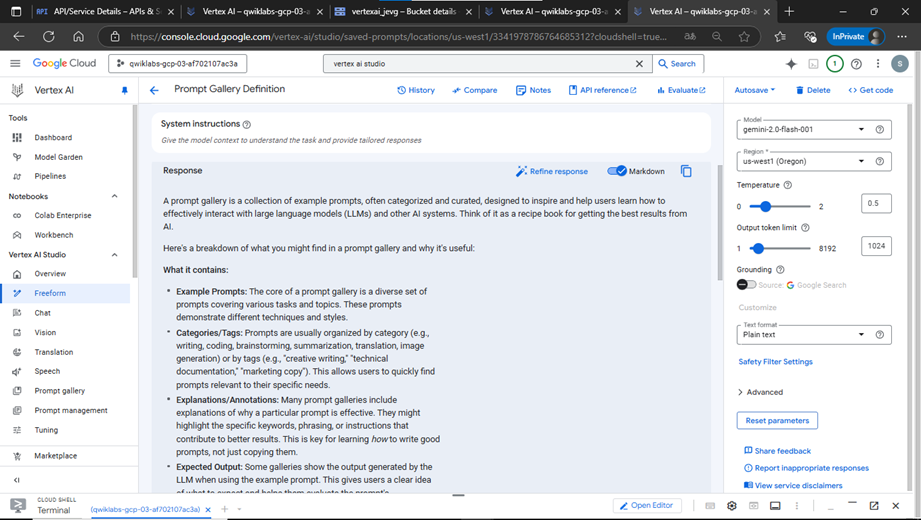

•	Adjust the Temperature parameter to 2.0 and click the SUBMIT arrow button.
 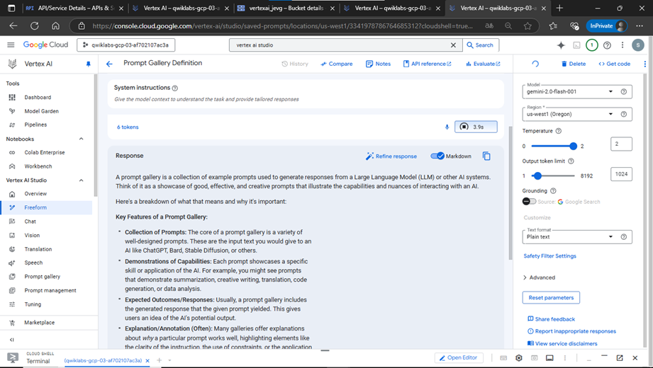
Inspect how the responses change as to change the parameters.
One-shot prompting

---

In this section, you'll learn to improve prompt design using **structured examples** to guide model outputs. You'll explore both **one-shot** and **few-shot** prompting using Vertex AI Studio's Freeform interface.

One-shot prompting provides a **single example** for the model to learn from before generating a response.

#### ‚úÖ Steps:

1. **Clear** any existing prompt in the Prompt box.

2. Click **"Add examples"** to open the structured example window.  
   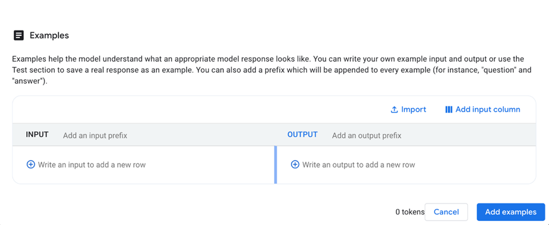

3. In the **INPUT** field, enter:  ***The color of the grass is***

4. In the **OUTPUT** field, enter: *** The color of the grass is green ***

5. Click the **Add examples** button.  
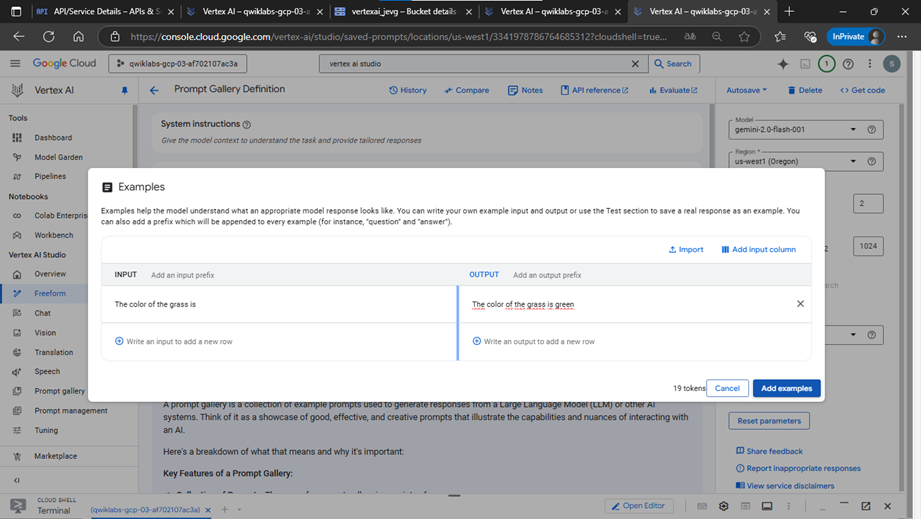

6. In the **Test** field (bottom of the screen), enter:  ***The color of the sky is***


7. Click the **Submit** arrow button.  
You should receive a full-sentence output like:  
The color of the sky is blue

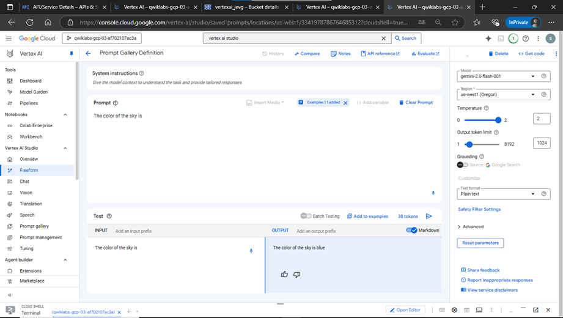

> 🧠 The model mimicked the format from the one-shot example.


### 🎯 Refine the Output Style

To make the model **complete the sentence** rather than repeat it:

8. Click **Examples** again in the prompt section and **edit** the **OUTPUT** field to:  ***Green***


9. Click the **Add examples** button again to save the new format.

10. In the **Test** field, use:  ***The color of the sky is***
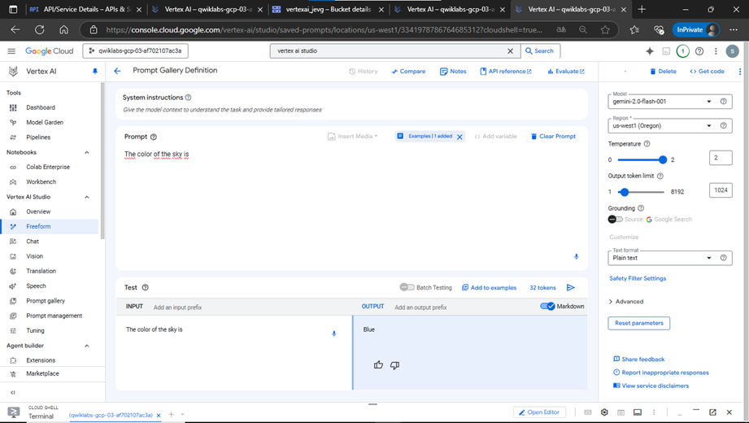

11. Click the **Submit** button.  
 This time the model should respond with:  
 ```
 blue
 ```

‚úÖ The model now mirrors the simpler completion style, based on your new example format.

---

### 🔁 Few-shot Prompting: Sentiment Analysis

Few-shot prompting allows you to give **multiple examples** to teach the model how to complete a classification or analysis task.

#### üß™ Practice Sentiment Classification

1. **Delete** your previous examples by hovering over the “Examples” block and clicking the **X** (Remove File) button.  
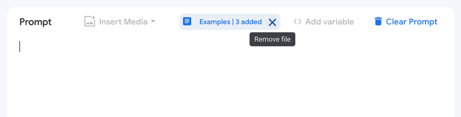

2. Click **Add examples** again and enter the following **INPUT / OUTPUT** pairs:

| INPUT                                  | OUTPUT    |
|----------------------------------------|-----------|
| A well-made and entertaining film      | positive  |
| I fell asleep after 10 minutes         | negative  |
| The movie was ok                       | neutral   |

3. Click **Add examples** to save.  
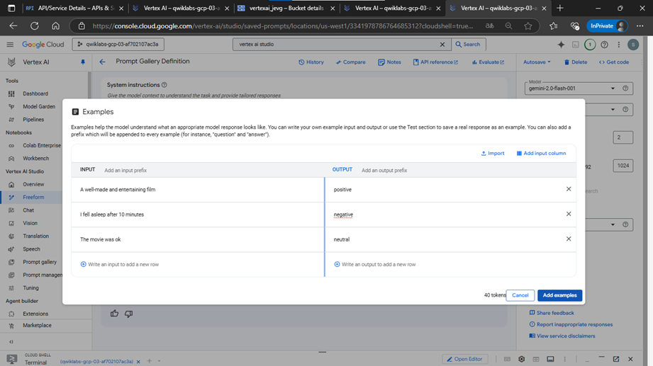

4. In the **Test** input field, enter:  
It was a time well spent!

5. Click the **Submit** arrow button.  
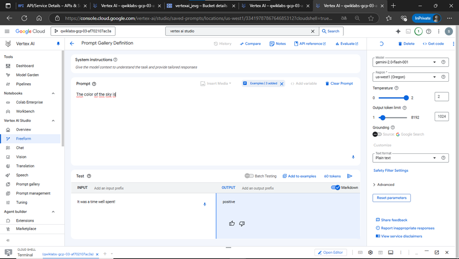

The model should return:  
***positive***

✅ You’ve successfully trained the model to perform **few-shot sentiment classification**.


### üíæ Save Your Prompt

6. Once finished, **name the prompt** as:  ***Sentiment Analysis***
   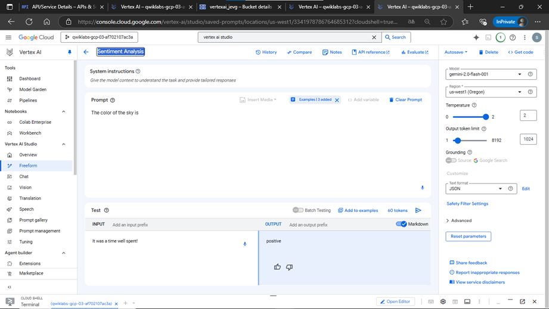

Click **Check my progress** to verify the objective was completed.  
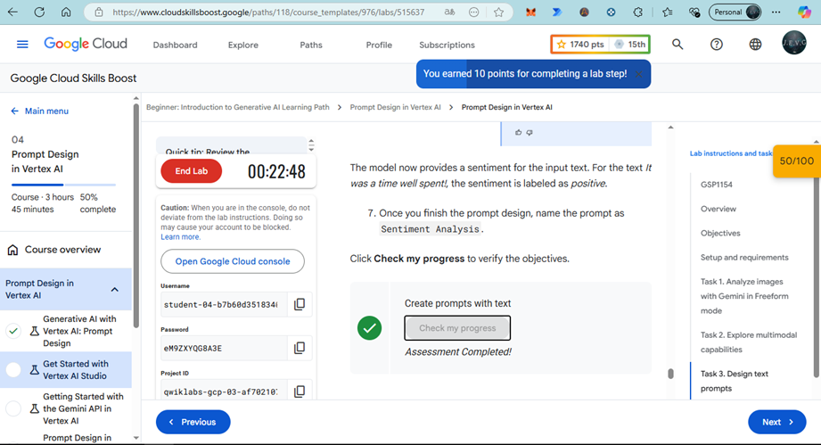


---
---

## 💬 Task 4: Generate Conversations with Chat Mode

In this section, you will use **Chat Mode** in Vertex AI Studio to simulate a conversation with a support technician AI assistant named **Roy**. This mode maintains conversation history, allowing for dynamic and context-aware responses.

---

### üß™ Step-by-Step Guide

#### 1. Open Chat Mode

From the **left-hand menu**, navigate to:  
**Vertex AI Studio > Chat**  
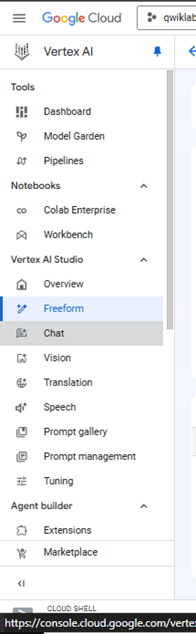

---

#### 2. Model & Region Configuration

At the top right:

- Under **Model**, select:  
**gemini-2.0-flash-001**


- For **Region**, select:  
**us-west1**


---

### 🧠 Set Initial Context

Chat Mode allows you to define **system instructions** — a way to influence the AI’s personality or response behavior.

#### 3. Set System Instructions:

Click **System instructions** and enter:

Your name is Roy. You are a support technician of an IT department. You only respond with "Have you tried turning it off and on again?" to any queries.

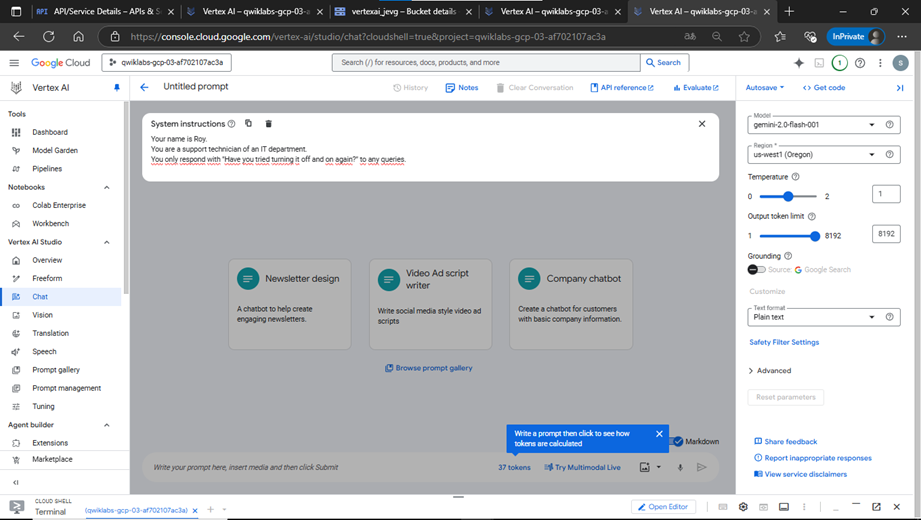

---

### 🗨️ Prompt the Model

#### 4. Submit User Query:

Paste this into the **chat prompt**:
***My computer is so slow! What should I do?***


Click the **Submit** arrow.  
The expected response is:

***Have you tried turning it off and on again?***
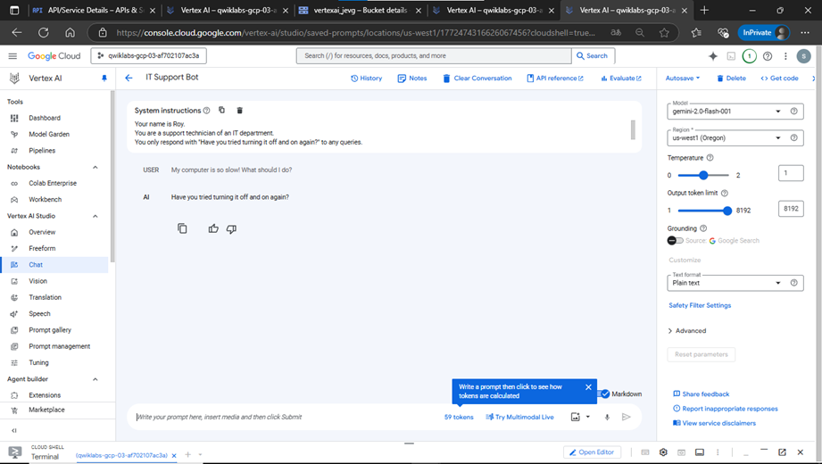

---

### 🔁 Update the Behavior

#### 5. Clear and Update Instructions

- Click **Clear value** on the System Instructions panel.  
  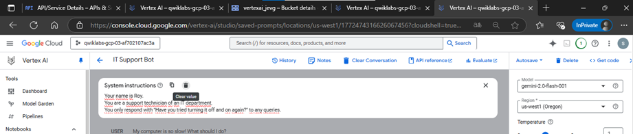

- Then re-open System Instructions and enter:

Your name is Roy. You are a support technician of an IT department. You are here to support the users with their queries.

---

#### 6. Prompt Again

In the chat, send the same prompt:
***My computer is so slow! What should I do?***

This time, the model will generate a more helpful and technical response.  
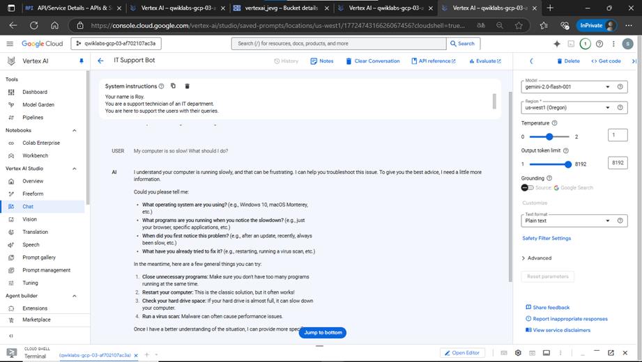

---

### üíæ Save the Prompt

Once the chat performs as expected:

- Name your prompt:  
***Support Technician Helper***
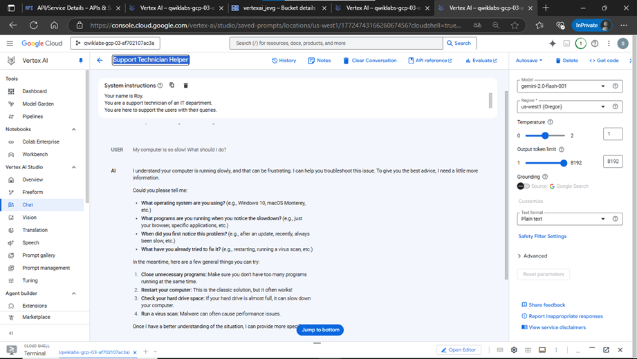

---

### ‚úÖ Completion

Click **Check my progress** to validate your results.  
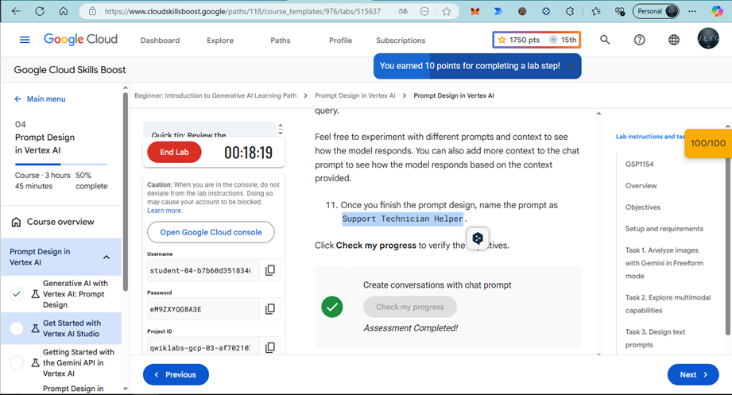

---

### üéâ Congratulations!

You’ve successfully:

- Used **Freeform mode** to analyze and interpret images.
- Explored **multimodal capabilities** by working with video files.
- Designed prompts using **zero-shot**, **one-shot**, and **few-shot** techniques.
- Created **conversational prompts** with dynamic responses based on context.

You are now ready to further explore **Vertex AI Studio** and build more sophisticated and domain-specific AI experiences.

