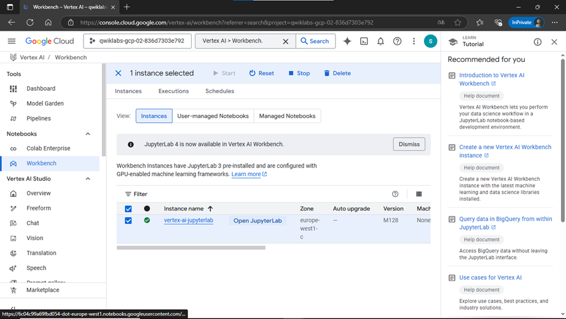
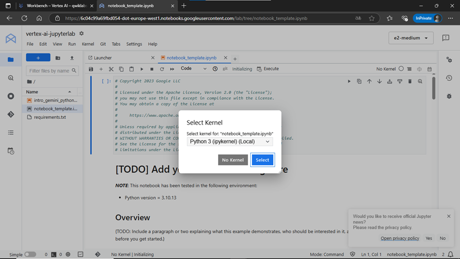
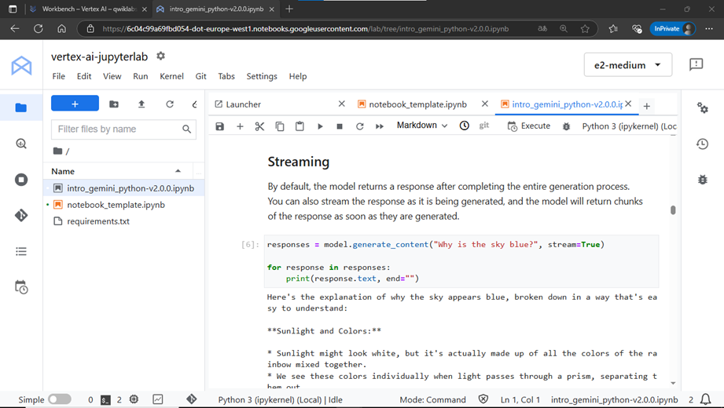

# 🚀 Getting Started with the Gemini API in Vertex AI

This guide provides a practical walkthrough for interacting with the **Gemini 1.5 Pro model** using the **Vertex AI Workbench** in Google Cloud. You’ll learn how to open and configure a Jupyter notebook, generate responses using Gemini, stream results, and test your own custom prompts.

---

## 🧪 Task 1: Open the Notebook in Vertex AI Workbench

1. In the **Google Cloud Console**, navigate to the Vertex AI Workbench:
   - Go to the **Navigation Menu** → `Vertex AI > Workbench`  
   

2. Locate the instance named `vertex-ai-jupyterlab` and click on **Open JupyterLab**.  
   

3. The **JupyterLab interface** should open in a new browser tab.  
   

---

## ⚙️ Task 2: Set Up the Notebook

1. In your JupyterLab environment, open the notebook file:  
   `intro_gemini_python.ipynb`  
   

2. When prompted, select the kernel:  
**Python 3**

3. Run the first sections of the notebook:
- Getting Started
- Import libraries  

Use the following configuration values:
- **Project ID:** `qwiklabs-gcp-02-836d7303e792`
- **Location:** `europe-west1`  

📌 **Note:**  
- Skip any cells labeled “Colab only.” 
- If a cell returns a **429 response**, wait for 1 minute before retrying.

---

## 🤖 Task 3: Use the Gemini 1.5 Pro Model

The **Gemini 1.5 Pro** (`gemini-1.5-pro`) is optimized for:
- Natural language processing
- Code generation
- Multi-turn chat
- Multimodal input (depending on model support)

---

### 📝 Generate Text from Text Prompts

- Execute the cells in the **Generate text from text prompts** section of the notebook.  

✅ Click **Check my progress** when complete.

---

### 🌐 Streaming Responses

By default, the model responds after the full output is generated. You can also enable **streaming**, where the model returns responses in **real-time chunks**.

- Run the cells under the **Streaming** section.  

✅ Click **Check my progress** when complete.

---

### ✍️ Try Your Own Prompts

- Test custom prompts by running the **Try your own prompts** section of the notebook.  

Use this space to experiment with natural language inputs and observe Gemini's output.

---

### ✅ Final Tip

Continue iterating on your own use cases and experiment with different prompt styles, streaming configurations, and response formats to better understand Gemini's capabilities within Vertex AI.

## 🔐 Safety Filters

The **Gemini API** provides **safety filters** that allow you to adjust the content moderation levels for your use case. These filters help restrict or allow certain categories of content based on risk ratings.

- Run the cells under the **Safety filters** section of the notebook to inspect how safety ratings are applied and retrieved.  
  

✅ Click **Check my progress** to verify:  
`Safety filters.`

---

## 💬 Test Chat Prompts

The Gemini API supports **multi-turn conversations** — ideal for back-and-forth natural language exchanges.

- Run the **Test chat prompts** section of the notebook to try conversational interactions with the model.  
    

✅ Click **Check my progress** to verify:  
`Test chat prompts.`
  
 

## 🧠 Task 4: Generate Text from a Multimodal Prompt

The **Gemini 1.5 Pro** model supports **multimodal input**, combining text, images, and videos in a single prompt.

---

### 🖼️ Generate Text from Local Image and Text

- Run the notebook cells under **Generate text from local image and text**.  
  

✅ Click **Check my progress** to verify:  
`Generate text from local image and text.`

---

### 🖼️ Generate Text from Text and Image(s)

- Proceed to the **Generate text from text & image(s)** section in the notebook.  
  

✅ Click **Check my progress** to verify:  
`Generate text from text and image(s).`

---

### 🖼️📚 Combine Multiple Images and Text for Few-Shot Prompting

- Explore the **Combining multiple images and text prompts for few-shot prompting** section.  
  

✅ Click **Check my progress** to verify:  
`Combining multiple images and text prompts for few-shot prompting.`

### 🎥 Generate Text from a Video File

- Run the **Generate text from a video file** section to test Gemini’s ability to extract insights from video.  
  

✅ Click **Check my progress** to verify:  
`Generate text from a video file.`

---

### 🌐 Direct Analysis of Web Media

- Navigate to the **Direct analysis of publicly available web media** section in the notebook.  
    
  

✅ Click **Check my progress** to verify:  
`Direct analysis of publicly available web media.`  
  

## 🎉 Congratulations!

In this lab, you explored the **Gemini 1.5 Pro model** using the **Vertex AI Python SDK**. You learned how to:

- Generate text from text, image, and video inputs.
- Use safety filters.
- Engage in multi-turn conversations.
- Apply few-shot prompting with multimodal inputs.

You are now well-equipped to design intelligent applications using Gemini in Vertex AI!  
  

  
🌟 Did you find any repository useful?

  If any project has been helpful to you, consider giving it a ⭐ star in the repository and follow my GitHub account to stay tuned for future updates! 🚀

  In addition, I am always open to suggestions, recommendations or collaborations. Feel free to [get in touch](https://www.linkedin.com/in/vazquez-galan-jose-emmanuel-664968221) if you have any questions or ideas for improving this project. I'm excited for your feedback and contributions.

  Thank you for your interest and support! 😊

 This work is licensed under a <a rel="license" href="http://creativecommons.org/licenses/by-nc-sa/4.0/">Creative Commons Attribution-NonCommercial-ShareAlike 4.0 International License</a>.

