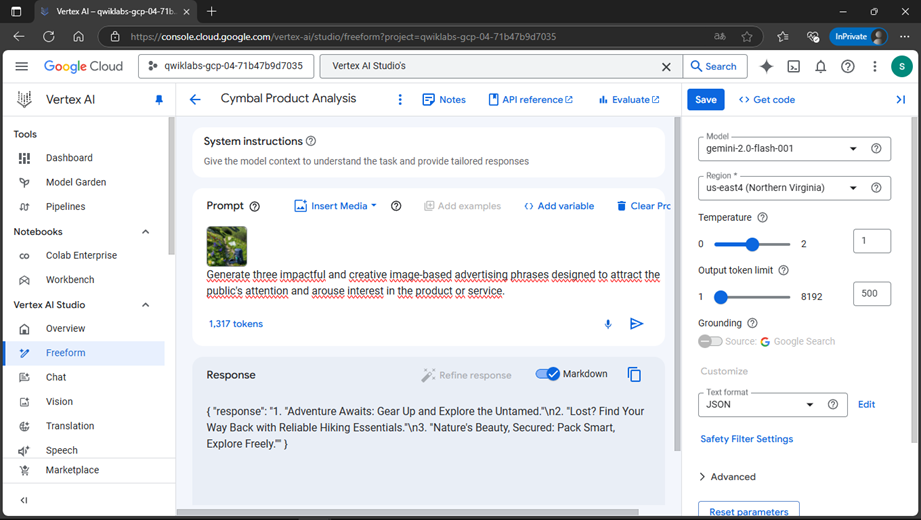
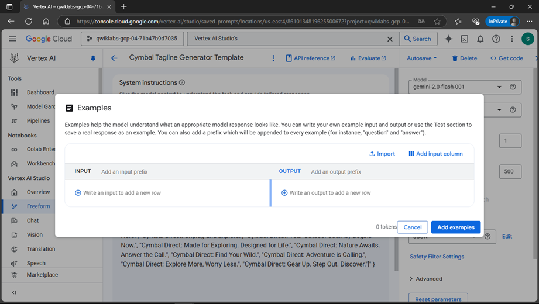
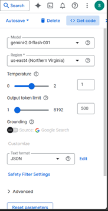
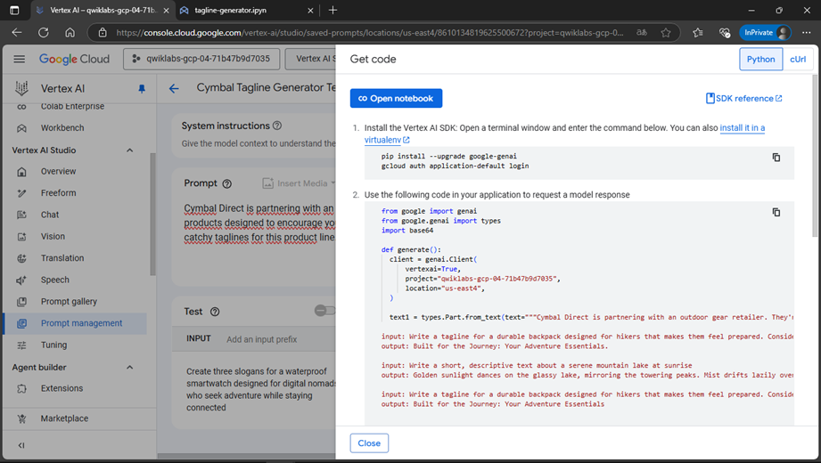

# 📘 **Building AI-Powered Product Analysis & Tagline Generation Tools with Gemini in Vertex AI**
This guide provides step-by-step instructions for developing AI-powered **image analysis** and **tagline generation** tools using **Vertex AI Studio** and **Jupyter Notebooks**. By following this guide, you will learn how to **analyze product images**, **generate marketing taglines**, and **experiment with AI-driven creativity**.

For initial setup steps, please refer to:  
📄 [`Prompt_Design_in_Vertex_AI-JEVG/GenerativeAI_with_VertexAI:PromptDesign/Vertex_AI_Workbench_JEVG.md`](Prompt_Design_in_Vertex_AI-JEVG/GenerativeAI_with_VertexAI:PromptDesign/Vertex_AI_Workbench_JEVG.md)  

---

## 🖼️ **Task 1: Build a Gemini Image Analysis Tool**
In this task, you will create a **template for analyzing product images** using **Gemini in Vertex AI Studio**. The model will generate descriptive text based on an image.

### **1️⃣ Open Vertex AI Studio**
1. In the **Google Cloud Console**, navigate to **Vertex AI > Studio**.
2. Select the **Gemini-2.0-flash-001** model.
3. Open the **Freeform interface** to analyze the product image.

📌 *The image for this task is located at:*  
`gs://qwiklabs-gcp-04-71b47b9d7035-labconfig-bucket/img/cymbal-product-image.png`

   -   
   -   
   -   

---

### **2️⃣ Generate Descriptive Text**
Use different **prompt styles** to generate **multiple descriptions**:  
- **Short, concise descriptions**  
  -   
- **Catchy marketing phrases**  
  -   
- **Poetic or evocative descriptions**  
  -   

📌 *Experiment with different prompts and refine your results.*  
📌 *Save your prompt as `Cymbal Product Analysis` in your selected region.*

   -   

✅ **Progress Check:** Ensure that the model is generating **accurate and creative** image-based descriptions.  
   -   

---

## 🏷️ **Task 2: Build a Gemini Tagline Generator**
In this task, you will develop a **customizable tagline generator** for **Cymbal Direct’s new product line**.

### **1️⃣ Create a Freeform Prompt**
1. Open **Vertex AI Studio** and create a **new Freeform prompt**.
2. Use the **Gemini-2.0-flash-001** model.
3. Enter **system instructions**:
   ```text
   Cymbal Direct is partnering with an outdoor gear retailer. 
   They're launching a new line of products designed to encourage 
   young people to explore the outdoors. Help them create catchy taglines for this product line.
    ```
 


### **1️⃣ Adding Example Inputs & Outputs**
To guide AI-generated responses, **examples** should be included in the **Freeform prompt**:

- **Example Input:**  
  *Write a tagline for a durable backpack designed for hikers that makes them feel prepared. Consider styles like minimalist.*
- **Example Output:**  
  *Built for the Journey: Your Adventure Essentials.*

📌 *Including relevant examples ensures better alignment with brand messaging.*  
   -   
   -   

---

### **2️⃣ Designing a Customizable Prompt**
To make the tagline generator adaptable, define **key parameters**:
- **Product attributes:** *e.g., durable, lightweight, waterproof*
- **Target audience:** *e.g., young adventurers, families, solo travelers*
- **Emotional resonance:** *e.g., empowerment, connection, nostalgia*

📌 *A well-structured prompt allows the model to generate diverse outputs.*  
   -   

---

### **3️⃣ Testing & Refining the Prompt**
1. Enter a **sample input** in the **Test box** and **submit** the request.
2. **Experiment** with different combinations of **product attributes**, **audiences**, and **emotional tones**.
3. **Refine** the prompt wording, **adjust parameters**, and improve response diversity.

📌 *Iterate until the tagline generator produces high-quality, varied taglines.*  
   -   

---

### **4️⃣ Saving & Managing the Prompt**
1. **Name your prompt:** *Cymbal Tagline Generator Template*
2. **Save the prompt** in the correct region.
3. **Verify** that the prompt appears in **Prompt Management**.

📌 *Ensure autosave is enabled to prevent progress loss.*  
   -   
   -   

---

## 🖼️ **Task 3: Experimenting with Image Analysis Code**
In this section, you will modify **Python code** for image analysis to **improve descriptions**.

### **1️⃣ Opening JupyterLab**
1. **Navigate to**: `Vertex AI > Workbench`
2. **Launch** JupyterLab.
3. **Create a new notebook** named `image-analysis.ipynb`.
4. **Set the kernel to Python 3**.

📌 *JupyterLab allows you to directly experiment with AI model responses.*  
   -   
   -   

---

### **2️⃣ Retrieving the Image Analysis Code**
1. **Go to Prompt Management** in Vertex AI Studio.
2. **Select** *Cymbal Product Analysis*.
3. **Click “Get Code”** and **copy the Python code**.

📌 *This code allows you to analyze product images and generate AI-powered descriptions.*  
   -   
      -   


📌 *Ensure dependencies are installed before running the code.*  
   - 
      -   
  

---

### **3️⃣ Modifying the Image Analysis Prompt**
1. Locate the **prompt text** inside the code:
   ```python
   """Describe this image with a focus on colors, textures, and the feeling it evokes."""


## **2️⃣ Modify the Image Analysis Prompt**
Now you will refine the prompt to generate **concise and highly creative** image descriptions.

1. **Make the output more specific** by limiting it to **less than 10 words**.
   -   

2. Modify the prompt to **encourage more creative, unusual, and unexpected** descriptions.
   > 💡 *Hint:* Adjust one of the **parameters** in the code to influence creativity.

3. **Save the changes**, then **rerun the code** in your Jupyter notebook.

4. **Verify** that the generated descriptions are **shorter** and exhibit increased **creativity** compared to previous outputs.
   -   

📌 **Ensure you save your notebook file** before checking progress.
   -   

✅ **Experiment with image analysis code.**  
🔎 **Check my progress:**  
   -   

---

## **📂 Annex: Python Code Before & After Changes**
This section contains the **original** and **modified** versions of the Python script used for **image analysis**.

### **📌 Original Code**
1. **Install the Vertex AI SDK**  
   Open a terminal window and enter the following commands:
    1.	Install the Vertex AI SDK: Open a terminal window and enter the command below. You can also install it in a virtualenv 
    pip install --upgrade google-genai
    gcloud auth application-default login
    2.	Use the following code in your application to request a model response

   ```bash
    from google import genai
    from google.genai import types
    import base64
    def generate():
    client = genai.Client(
        vertexai=True,
        project="qwiklabs-gcp-04-71b47b9d7035",
        location="us-east4",
    )
    image1 = types.Part.from_uri(
        file_uri="gs://qwiklabs-gcp-04-71b47b9d7035-labconfig-bucket/cymbal-product-image.png",
        mime_type="image/png",
    )
    text1 = types.Part.from_text(text="""Write a short poem inspired by the image, with an evocative tone that highlights the beauty and connection to nature.""")
    model = "gemini-2.0-flash-001"
    contents = [
        types.Content(
        role="user",
        parts=[
            image1,
            text1
        ]
        )
    ]
    generate_content_config = types.GenerateContentConfig(
        temperature = 1,
        top_p = 0.95,
        max_output_tokens = 500,
        response_modalities = ["TEXT"],
        response_mime_type = "application/json",
        response_schema = {"type":"OBJECT","properties":{"response":{"type":"STRING"}}},
    )
    for chunk in client.models.generate_content_stream(
        model = model,
        contents = contents,
        config = generate_content_config,
        ):
        print(chunk.text, end="")
    generate()
    ```

#### Modified Code with Updated Prompt & Parameters
This version limits output length and increases creativity by tweaking temperature settings.

   ```bash
    from google import genai
    from google.genai import types
    import base64

    def generate():
    client = genai.Client(
        vertexai=True,
        project="qwiklabs-gcp-04-71b47b9d7035",
        location="us-east4",
    )

    image1 = types.Part.from_uri(
        file_uri="gs://qwiklabs-gcp-04-71b47b9d7035-labconfig-bucket/cymbal-product-image.png",
        mime_type="image/png",
    )
    text1 = types.Part.from_text(text="""Describe this image in less than 10 words. Be as creative, unusual, and unexpected as possible.""")

    model = "gemini-2.0-flash-001"
    contents = [
        types.Content(
        role="user",
        parts=[
            image1,
            text1
        ]
        )
    ]
    generate_content_config = types.GenerateContentConfig(
        temperature = 1.5,  # Increased for more creative responses
        top_p = 0.95,
        max_output_tokens = 20,  # Reduced to limit output length
        response_modalities = ["TEXT"],
        response_mime_type = "application/json",
        response_schema = {"type":"OBJECT","properties":{"response":{"type":"STRING"}}},
    )

    for chunk in client.models.generate_content_stream(
        model = model,
        contents = contents,
        config = generate_content_config,
        ):
        print(chunk.text, end="")

    generate()
```


# **🛠 Task 4: Experiment with Tagline Generation Code**
In this task, you will explore the Python code for the **tagline prompt** you created and modify it to include a **specific keyword**.

## **📌 Explore the Tagline Generator Code**
1. Inside your **Workbench instance**, create a new notebook file named **`tagline-generator.ipynb`** and set the **kernel to Python 3**.
   -   

2. From the **Vertex AI Studio page**, navigate to the **Prompt Management** section and select **Cymbal Tagline Generator Template**.
   -   

3. On the right side of the prompt, click **"Get Code"** and choose **Python** as the language.
   -   

   > 📝 **Note:** If you installed the required Python packages in a previous task, you don't need to install them again.
   -   

4. Run the **second code cell** in your notebook and verify that the code executes successfully, generating the expected tagline outputs.
   -   

---

## **✏️ Modify the Tagline Generation Prompt**
1. Locate the lines of text inside **triple quotes (`"""`)** within the code. This is your current tagline generation prompt.

2. **Modify the last input** to **explicitly require the tagline to include the keyword "nature".**
   -   

3. **Save the changes**, then **rerun the code cell** in your notebook to test Gemini with the new prompt.

4. **Verify** that the generated taglines include the **keyword "nature"** as required.
   -   

---

## **✅ Experiment with Tagline Generation Code**
Once your modifications are applied, you can **check your progress**:
   -   
   -   

> 📝 **Note:** If your score isn't updating, **wait a few minutes** and then click the **"Check My Progress"** button again.
   -   


## **📂 Annex: Python Code Before & After Changes**
Below are the **original** and **modified** versions of the Python script for tagline generation.

### **📌 Original Code**
1. **Install the Vertex AI SDK**  
   Open a terminal and enter:

    1.	Install the Vertex AI SDK: Open a terminal window and enter the command below. You can also install it in a virtualenv 
    pip install --upgrade google-genai
    gcloud auth application-default login
    2.	Use the following code in your application to request a model response

   ```bash
    from google import genai
    from google.genai import types
    import base64
    def generate():
    client = genai.Client(
        vertexai=True,
        project="qwiklabs-gcp-04-71b47b9d7035",
        location="us-east4",
    )
    text1 = types.Part.from_text(text="""Cymbal Direct is partnering with an outdoor gear retailer. They're launching a new line of products designed to encourage young people to explore the outdoors. Help them create catchy taglines for this product line.
    input: Write a tagline for a durable backpack designed for hikers that makes them feel prepared. Consider styles like minimalist.   
    output: Built for the Journey: Your Adventure Essentials.
    input: Write a short, descriptive text about a serene mountain lake at sunrise
    output: Golden sunlight dances on the glassy lake, mirroring the towering peaks. Mist drifts lazily over the water, as nature awakens in a quiet symphony of rustling leaves and birdsong
    input: Write a tagline for a durable backpack designed for hikers that makes them feel prepared. Consider styles like minimalist.
    output: Built for the Journey: Your Adventure Essentials
    input: Create three slogans for a waterproof smartwatch designed for digital nomads who seek adventure while staying connected
    output:""")
    model = "gemini-2.0-flash-001"
    contents = [
        types.Content(
        role="user",
        parts=[
            text1
        ]
        )
    ]
    generate_content_config = types.GenerateContentConfig(
        temperature = 1,
        top_p = 0.95,
        max_output_tokens = 500,
        response_modalities = ["TEXT"],
        response_mime_type = "application/json",
        response_schema = {"type":"OBJECT","properties":{"response":{"type":"STRING"}}},
    )
    for chunk in client.models.generate_content_stream(
        model = model,
        contents = contents,
        config = generate_content_config,
        ):
        print(chunk.text, end="")
    generate()
    ```
### 📌 Modified Code with Updated Prompt
This version ensures that the generated taglines include the keyword "nature".

   ```bash
    from google import genai
    from google.genai import types
    import base64

    def generate():
    client = genai.Client(
        vertexai=True,
        project="qwiklabs-gcp-04-71b47b9d7035",
        location="us-east4",
    )

    text1 = types.Part.from_text(text="""Cymbal Direct is partnering with an outdoor gear retailer. They're launching a new line of products designed to encourage young people to explore the outdoors. Help them create catchy taglines for this product line.

    input: Write a tagline for a durable backpack designed for hikers that makes them feel prepared. Consider styles like minimalist.	
    output: Built for the Journey: Your Adventure Essentials.

    input: Write a short, descriptive text about a serene mountain lake at sunrise
    output: Golden sunlight dances on the glassy lake, mirroring the towering peaks. Mist drifts lazily over the water, as nature awakens in a quiet symphony of rustling leaves and birdsong.

    input: Write a tagline for a durable backpack designed for hikers that makes them feel prepared. Consider styles like minimalist.
    output: Built for the Journey: Your Adventure Essentials.

    input: Create three slogans for a waterproof smartwatch designed for digital nomads who seek adventure while staying connected.
    output: Stay Connected, Wherever Life Takes You.
            Adventure Without Limits, Connection Without Compromise.
            Waterproof. Smart. Always Ready.

    input: Write a tagline for an eco-friendly hiking backpack that emphasizes sustainability. Ensure that the tagline includes the keyword 'nature'.
    output: Carry Nature, Leave No Trace.

    input: Create three slogans for a new outdoor clothing line that embodies adventure and connection with nature. Ensure that each tagline includes the keyword 'nature'.
    output: Nature Calls—Answer the Adventure.
            Wear the Wild, Embrace Nature.
            Gear Up. Explore Nature. Feel Alive.
    """)

    model = "gemini-2.0-flash-001"
    contents = [
        types.Content(
        role="user",
        parts=[text1]
        )
    ]
    generate_content_config = types.GenerateContentConfig(
        temperature = 1,
        top_p = 0.95,
        max_output_tokens = 500,
        response_modalities = ["TEXT"],
        response_mime_type = "application/json",
        response_schema = {"type":"OBJECT","properties":{"response":{"type":"STRING"}}},
    )

    for chunk in client.models.generate_content_stream(
        model = model,
        contents = contents,
        config = generate_content_config,
        ):
        print(chunk.text, end="")

    generate() 
   ```


---

## **🎉 Congratulations!**
You have successfully completed this lab! 🎉 
- You helped **Cymbal Direct** streamline the creation of **evocative product descriptions** and **catchy taglines** using **Google Cloud's Vertex AI platform**.
- You explored and **modified** both the **image analysis** and **tagline generation** code within a Jupyter notebook.

Great job! 🚀  
   -   

---


<details>
  <summary>🌟 Did you find any repository useful?</summary>
  If any project has been helpful to you, consider giving it a ⭐ star in the repository and follow my GitHub account to stay tuned for future updates! 🚀

  In addition, I am always open to suggestions, recommendations or collaborations. Feel free to [get in touch](https://www.linkedin.com/in/vazquez-galan-jose-emmanuel-664968221) if you have any questions or ideas for improving this project. I'm excited for your feedback and contributions.

  Thank you for your interest and support! 😊
</details>


<p align="center">
<a rel="license" href="http://creativecommons.org/licenses/by-nc-sa/4.0/"></a><br />This work is licensed under a <a rel="license" href="http://creativecommons.org/licenses/by-nc-sa/4.0/">Creative Commons Attribution-NonCommercial-ShareAlike 4.0 International License</a>.
</p>
